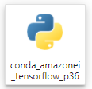
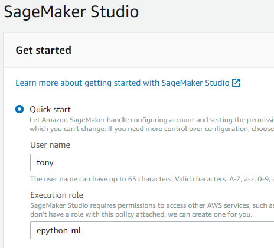
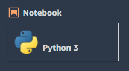
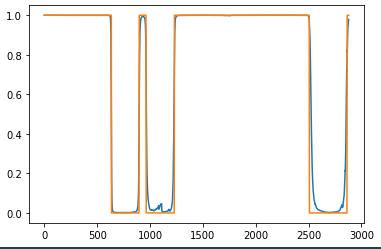

Machine Learning
================

Sage Maker
----------

Notebook
^^^^^^^^

From AWS Sage Maker, under Notebook select `Notebook instances`. Create instance and select `Open JupyterLab`

Choose `conda_amazonei_tensorflow_p36` as a kernel.

Sage Maker Studio
^^^^^^^^^^^^^^^^^

On the panel on the left choose `Amazon SageMaker Studio` and do `Quick start`

Put your name in the `User name` field and choose `epython-ml` for Execution role.

Once the studio is ready, we can open it.

.. image:: _static/images/sage_maker_open_studio.PNG

For the SageMaker image, choose one that is relevent for you.

In this example I'm using Tensorflow. I have chose CPU instead of GPU because.

1. I am just experiementing for now and do not want to pay for GPU
2. The algorithm I am using is actually CPU bound because it relies on Training
   Sequence that generates training data on the fly. We will need to optimise this.

.. image:: _static/images/sage_maker_image_tf_cpu.PNG

Git
^^^

On the left hand side panel, select `Git`. Then put in your repo url

Optionally you could choose a different branch. I usually like to work on a development branch.

.. image:: _static/images/git_select_development_branch.PNG

Now go ahead and launch a Python 3 Notebook

Note: it may take a minute for the notebook to launch as it takes time to provision resources.

We could also setup our own image, but for now this is good enough.

We do however need to install whatever package we might want to use. 
Below is an example of running installation inside a Notebook cell.

.. code-block:: console

    !python3 -m pip install --upgrade pip
    !pip install kydb matplotlib feather-format s3fs

In order to be able to load modules from our Git checkout, we'll have to
add that to `os.sys.path`.

::

    import os
    os.sys.path.append('epython-showcase')

Optimal Position
----------------

For supervised training where we would like our neural network to learn when to long or short,
we would create the optimal position at any given point in time.

There is a class `ml.optimal_position.OptimalPositionGenerator` that allows us to do just that.

Usage:

::

    import kydb
    from datetime import date
    from ml.optimal_position import OptimalPositionGenerator

    db = kydb.connect('dynamodb://epython/timeseries')
    ts = db['symbols/bitflyer/minutely/FX_BTC_JPY']
    opg = OptimalPositionGenerator(ts, start_date, end_date)
    optimal = opg.generate()

Picking some random 3 days windows we would see that if we manage to trade like that, we'd be laughing.

Green is buy and red is sell.

.. image:: _static/images/optimal_strategy.PNG

See `Notebook <_static/notebooks/OptimalPositoinGenerator.html>`_ for more details.

TrainSequence
-------------

The class `ml.train_sequence.TrainSequence` provides generation of training data on the fly.

It takes the TimeSeries from `Optimal Position` and:

1. Increase dimension by creating last n observable prices for every minute of the training data set. This is X
2. Take Optimal position which is now Y. So now we have X predicting Y.
3. Shuffle the training dataset on each Epoch.

For step one, there is a parameter `lookback_period` that can be used to control how far back the neutral network
can see when training.

The `TrainSequence` can be instantiated like this:

::

    start_date = date(2017, 6, 1)
    end_date = date(2020, 6, 1)
    db = kydb.connect('dynamodb://epython/timeseries')
    ts = db['/symbols/ml/training_data/FX_BTC_JPY']
    pos_df = ts.curve(start_date, end_date)
    seq = TrainSequence(pos_df.reset_index()[['mid', 'position']].copy())

Example Tensorflow model
------------------------

Setting up the model
^^^^^^^^^^^^^^^^^^^^

With `TrainSequence` defined we can get creative and design a TensorFlow model.

Exactly what kind of layers, how many layers, nodes per layer, activation function is
already an art more than science. On top of that we still have choices of
optimizer, loss function, etc..

Luckily AWS Sage Maker makes hyper-parameter optimisation easy.
We will cover that in a later chapter.

So this the below is just an example that I found to give good results.

There are 4 layers:

1. Dense (fully connected) layer with 1024 nodes and ReLU (Rectified Linear Unit) as activation function.
2. Dense layer with 1024 nodes and uses ReLU activation function.
3. Dropout of 0.2 to regulate the network.
4. Dese with just 2 nodes representing buy or sell. Use softmax activation function.

::

    model = tf.keras.models.Sequential([
    tf.keras.layers.Dense(1024, input_shape=(seq.lookback_period,), activation=tf.nn.relu),    
    tf.keras.layers.Dense(1024, activation=tf.nn.relu),  
    tf.keras.layers.Dropout(0.2),
    tf.keras.layers.Dense(2, activation=tf.nn.softmax)
    ])

Compile the module. use `adam` optimiser `sparse_categorical_crossentropy` as loss function of
and display `accuracy` as it optimises.

::

    model.compile(optimizer='adam',
                loss='sparse_categorical_crossentropy',
                metrics=['accuracy'])              

Now we're all set. Let's fit the model.

Training the model
^^^^^^^^^^^^^^^^^^

::

    model.fit_generator(generator=seq, epochs=10, workers=cpu_count(), use_multiprocessing=True))

Modle performance
^^^^^^^^^^^^^^^^^

We can see the performance during training. Loss should be coming down
and accuracy would be go up.

.. code-block:: console

    Epoch 1/10
    119/119 [==============================] - 203s 2s/step - loss: 0.7163 - acc: 0.5772
    Epoch 2/10
    119/119 [==============================] - 200s 2s/step - loss: 0.6434 - acc: 0.6338
    Epoch 3/10
    119/119 [==============================] - 199s 2s/step - loss: 0.6283 - acc: 0.6495
    Epoch 4/10
    119/119 [==============================] - 200s 2s/step - loss: 0.6142 - acc: 0.6645
    Epoch 5/10
    119/119 [==============================] - 199s 2s/step - loss: 0.6010 - acc: 0.6759
    Epoch 6/10
    119/119 [==============================] - 199s 2s/step - loss: 0.5890 - acc: 0.6863
    Epoch 7/10
    119/119 [==============================] - 199s 2s/step - loss: 0.5702 - acc: 0.7024
    Epoch 8/10
    119/119 [==============================] - 199s 2s/step - loss: 0.5528 - acc: 0.7157
    Epoch 9/10
    119/119 [==============================] - 200s 2s/step - loss: 0.5307 - acc: 0.7322
    Epoch 10/10
    119/119 [==============================] - 199s 2s/step - loss: 0.5036 - acc: 0.7516

Of course. Instead of running 3 years of minutely data and hope it all works we can always reduce
the size of the neural network and run on a smaller set of data.

Here is what what happens if we reduce nodes to 512 on the dense network,
train the model and then use the model to predict.

Orange line is the optimal position, blue is the prediciton.

