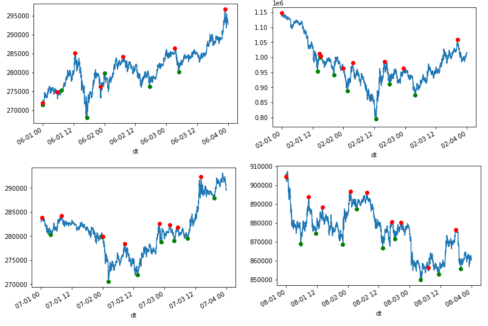

Learning to Trade
=================

Introduction
------------

There are 3 parts to this article. 

1. Generating the data to learn.

2. Model with Tensorflow and learn.

3. Test the performance and see the PnL

Optimal Trading Strategy
------------------------

First, let's analyse the historical market data and create an optimal trading strategy
for which the machine would learn.

Red is short and Green is long.

Details can be found here: :doc:`optimal_position`. 

Training the Model
------------------

Now it is time to learn, given the last n number of observations, should we be long or short.

Details can be found here: :doc:`training_the_model`. 

.. image:: ../_static/images/trade_position_prediction.PNG

Test Performance
----------------

How well do we do in training data and test (unseen data)?

Details can be found here: :doc:`test_performance`. 

.. image:: ../_static/images/performance_final_pnl.PNG

Turns out we're able to make a 29% return.