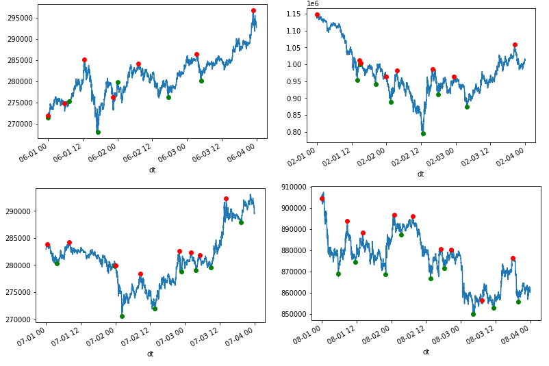

Optimal Position
================

For supervised training where we would like our neural network to learn when to long or short,
we would create the optimal position at any given point in time.

There is a class
`ml.optimal_position.OptimalPositionGenerator <https://github.com/emagine-epython/epython-showcase/blob/master/ml/optimal_position.py>`_
that allows us to do just that.

Usage:

::

    import kydb
    from datetime import date
    from ml.optimal_position import OptimalPositionGenerator

    db = kydb.connect('dynamodb://epython/timeseries')
    ts = db['symbols/bitflyer/minutely/FX_BTC_JPY']
    opg = OptimalPositionGenerator(ts, start_date, end_date)
    optimal = opg.generate()

Picking some random 3 days windows we would see that if we manage to trade like that, we'd be laughing.

Green is buy and red is sell.

See `Optimal Position Notebook <../_static/notebooks/OptimalPositoinGenerator.html>`_ for more details.
