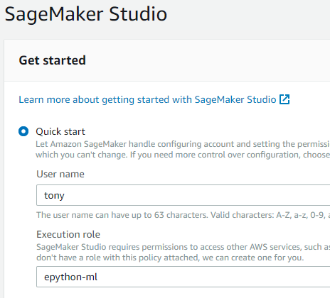
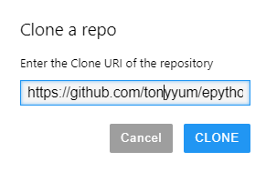
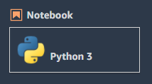

Sage Maker
==========

Sage Maker Notebook
-------------------

From AWS Sage Maker, under Notebook select `Notebook instances`. Create instance and select `Open JupyterLab`

Choose `conda_amazonei_tensorflow_p36` as a kernel.

Sage Maker Studio
-----------------

On the panel on the left choose `Amazon SageMaker Studio` and do `Quick start`

Put your name in the `User name` field and choose `epython-ml` for Execution role.

Once the studio is ready, we can open it.

For the SageMaker image, choose one that is relevent for you.

In this example I'm using Tensorflow. I have chose CPU instead of GPU because.

1. I am just experiementing for now and do not want to pay for GPU
2. The algorithm I am using is actually CPU bound because it relies on Training
   Sequence that generates training data on the fly. We will need to optimise this.

Git
---

On the left hand side panel, select `Git`. Then put in your repo url

Optionally you could choose a different branch. I usually like to work on a development branch.

Now go ahead and launch a Python 3 Notebook

Note: it may take a minute for the notebook to launch as it takes time to provision resources.

We could also setup our own image, but for now this is good enough.

We do however need to install whatever package we might want to use. 
Below is an example of running installation inside a Notebook cell.

.. code-block:: console

    !python3 -m pip install --upgrade pip
    !pip install kydb matplotlib feather-format s3fs

In order to be able to load modules from our Git checkout, we'll have to
add that to `os.sys.path`.

::

    import os
    os.sys.path.append('epython-showcase')
