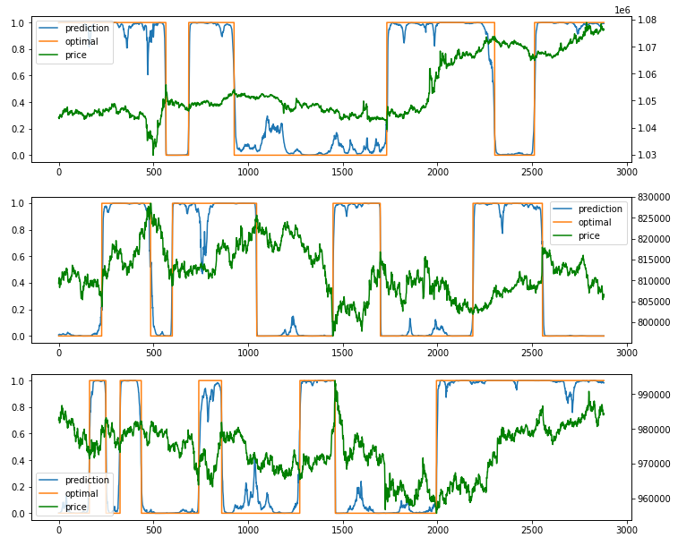
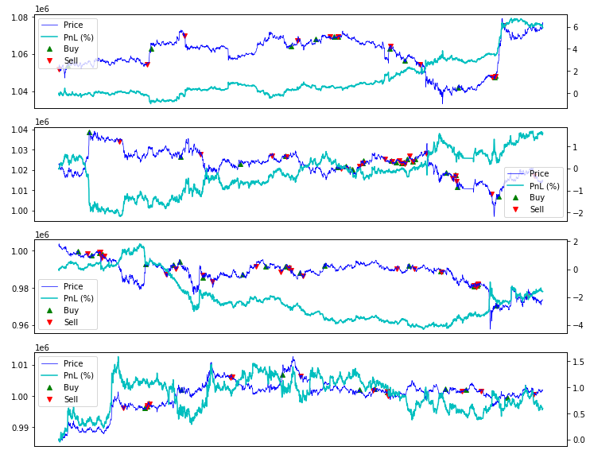
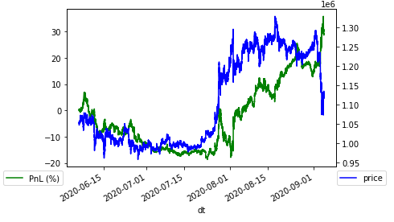

Test Performance
================

Perfornace on Test Data
-----------------------

Pull in data from timeseries DB 

::

    start_date = date(2019, 6, 1)
    end_date = date(2020, 6, 1)
    db = kydb.connect('dynamodb://epython/timeseries')
    ts = db['/symbols/ml/training_data/FX_BTC_JPY']
    pos_df = ts.curve(start_date, end_date)

Download the model

::

    model_file = 'fx_btc_jpy_model.h5'
    db = kydb.connect('s3://epython')
    model_data = db['/ml/models/' + model_file]
    local_path = '/tmp/' + model_file
    with open(local_path, 'wb') as f:
        f.write(model_data)

    model = load_model(local_path)

The model can be applied to subset of data ``t1`` and ``t2`` like this.

::
        
    seq = TrainSequence(pos_df[t1:t2].reset_index()[['mid', 'position']].copy(), enable_shuffle=False)
    p = Pool(cpu_count())
    batches = p.map(get_batch, enumerate([seq] * len(seq)))

Pick some random dates to see how closely predict is vs optimal.

Recommendation looks good. The recommendation plot is the raw value. In reality it is rounded to 0 or 1. However we have not plotted that because it will be hard to see as it overlaps with the optimal position.

Trading on unseen data
----------------------

Load 3 months of data beyond the training data

::

    db = kydb.connect('dynamodb://epython/timeseries')
    ts = db['symbols/bitflyer/minutely/FX_BTC_JPY']
    md = ts.curve(date(2020, 6, 5), date(2020, 9, 5))
    md.sort_index(inplace=True)
    # Let's make it exactly 91 days
    md = md[:91 * 60 * 24]

Creating the sequence

::

    valid_data = md.reset_index().copy()
    valid_data['position'] = 0
    valid_seq = TrainSequence(valid_data, enable_shuffle=False, batch_size=60*24)

Do the prediction
^^^^^^^^^^^^^^^^^

ys_predict = model.predict(valid_seq, use_multiprocessing=True, workers=cpu_count())

Calculate PNL
^^^^^^^^^^^^^

::

    pnl_df = md[60*24:].copy()
    pos = ys_predict[:, 1]
    pnl_df['position'] = np.where(pos > 0.5, 1, -1)
    pnl_df = pnl_df.join(pnl_df[['mid', 'position']].shift(), rsuffix='_prev')
    pnl_df = pnl_df.iloc[1:].copy()
    pnl_df['trade'] = pnl_df.position - pnl_df.position_prev
    pnl_df.loc[pnl_df.index[0], 'trade'] = pnl_df.loc[pnl_df.index[0], 'position']
    pnl_df['pnl'] = pnl_df.position_prev * (pnl_df.mid - pnl_df.mid_prev) - \
                    pnl_df.trade * (pnl_df.ask - pnl_df.bid) / 2.
    pnl_df['pnl'] = pnl_df.pnl.cumsum()

Final Verdict
-------------

We have made 29% PnL in 3 months. Not bad huh?

