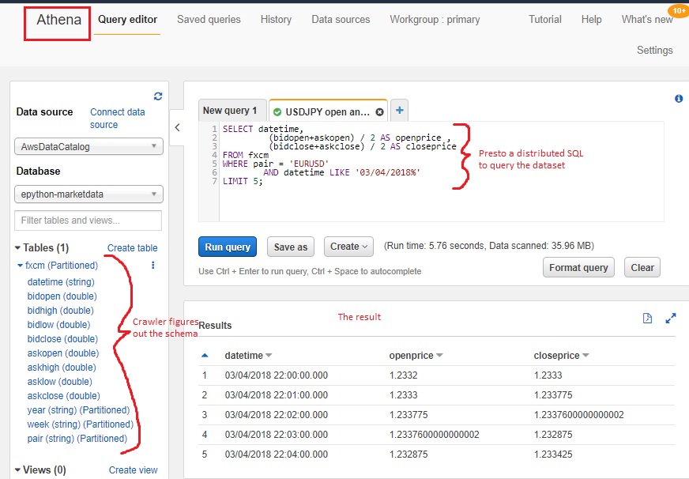

Market Data
===========

`Data Lake <https://en.wikipedia.org/wiki/Data_lake#:~:text=A%20data%20lake%20is%20usually,advanced%20analytics%20and%20machine%20learning.>`_
is an excellent way to store and query structured and unstructured data. In our case market data from various providers.
Rather than pulling our hair out confirming the exact schema our market data should be in, then spending our valuable
life time transforming data and thinking how to host it, let's just dump the data in S3 and let the Data lake technology do
the heavy lifting for us.

Welcome to `AWS Lake Formation <https://aws.amazon.com/lake-formation/?whats-new-cards.sort-by=item.additionalFields.postDateTime&whats-new-cards.sort-order=desc>`_

How does it work? Let's go through the steps.

Upload Market Data
------------------

Query any market data provider and stick the data straight into S3, no need for long discussion about schemas.

FXCM
^^^^

FX trading exchange. More infomation `here <https://www.fxcm.com/uk>`_.

We have a tool that download minutely FX Spot data.

Run:

.. code-block:: console

    python epython/marketdata/utils/fxcm.py --help

Output:

.. code-block:: console

    Usage: fxcm.py [OPTIONS]

    Options:

        --years TEXT  comma separated list of years  [required]
        --pairs TEXT  comma separated list of pairs  [required]
        --help        Show this message and exit.

Run for 1 year and 1 ccy:

.. code-block:: console

    python epython/marketdata/utils/fxcm.py --year 2018 --ccy USDJPY

Or knock ourselves out with data:

.. code-block:: console

    python epython/marketdata/utils/fxcm.py \
        --years=2014,2015,2016,2017,2018 \
        --pairs=EURUSD,GBPUSD,NZDUSD,USDCAD,USDCHF,USDJPY

All the data would now go to ``s3://epython-marketdata/fxcm``

they would be placed into an s3 path with some partitioning syntax. Below is one example.

.. code-block:: console

    /fxcm/year=2018/week=D11/pair=GBPUSD/GBPUSD.gz

Notice they are just gzipped csv files exactly as they were downloaded from the the FXCM.

Bitflyer
^^^^^^^^

Tokyo based `BitCoin exchange <https://lightning.bitflyer.com/>`_

Run:

.. code-block:: console

    python -m epython.marketdata.utils.bitflyer --help
    Usage: bitflyer.py [OPTIONS] COMMAND [ARGS]...

Output:

.. code-block:: console

    Options:
      --help  Show this message and exit.

      Commands:
        download  Download BitFlyer marketdata from TAY Global Ltd to dest folder.
          upload    Upload to epyton-marketdata from local src folder

AWS Glue
--------

`AWS Glue <https://aws.amazon.com/glue/>`_ provides `crawlers <https://docs.aws.amazon.com/glue/latest/dg/add-crawler.html>`_
which would crawl through your dataset and figure out the meta data (for example schema) and create a table for your data.

AWS Athena
----------

`Athena <https://aws.amazon.com/athena/>`_ is a serverless query service. You can query your distributed data using 
`Presto <https://prestodb.io/>`_ (the Distributed SQL query engine).

Remember our data is large (years of minutely data for different pairs) and it is distributed. We can run complicated 
queries on that same data fast, really fast.

Life Cycle
----------

Athena queries are stored in an s3 bucket `epython-athena`.

This means repeated query would return very quickly, but it would also mean that the bucket would progressively get larger.

We could solve this by adding a lifecycle rule to the bucket.

Apply to all objects in the bucket

We can transition data into cheaper storage if there is a regulatory requirement.
But in this case we do not need that.

Now we choose to expire and delete objects from this bucket after 7 days.

Acknowledge that object in this bucket would live only for 7 days.

