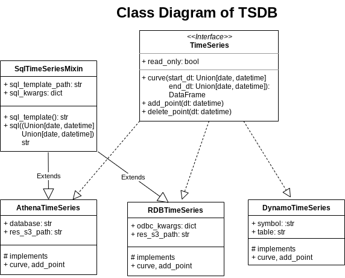

TimeSeries DB (TSDB)
====================

Introduction
------------

TSDB is used for accessing time series data.
It provides a well defined interface regardless of how of the implementation.

Lookup the list of available symbols:

::

    import kydb
    db = kydb.connect('dynamodb://epython/timeseries')
    db.ls('/symbols/fxcm/minutely')
    
Output

::

    ['USDJPY', 'USDCAD', 'USDCHF', 'EURUSD', 'NZDUSD', 'GBPUSD']
    
    
Load the time series data from the symbol:
    
::

    ts = db['/symbols/fxcm/minutely/USDJPY']
    ts.curve(datetime(2017, 5, 1), datetime(2017, 5, 3)).head()
    
Output

.. code-block:: console

                         closeprice
    dt                             
    2017-05-01 00:00:00    111.3050
    2017-05-01 00:01:00    111.3235
    2017-05-01 00:02:00    111.3355
    2017-05-01 00:03:00    111.3530
    2017-05-01 00:04:00    111.3655
    

Classes
-------

Setting Up ObjDB
----------------

To tell KYDB how to serialise TimeSeries. Run the below (More information
`here <https://kydb.readthedocs.io/en/latest/examples.html#python-object-db>`_):

::

    import kydb
    db = kydb.connect('dynamodb://epython/timeseries')

    OBJDB_CONFIG = {
        'AthenaTimeSeries': {
            'module_path': 'tsdb.athena',
            'class_name': 'AthenaTimeSeries'
        }
    }
    
    db.upload_objdb_config(OBJDB_CONFIG)
    

Minutely TimeSeries
-------------------

FXCM
^^^^

For ``AthenaTimeSeries`` we create a sql template.

::

    import kydb
    db = kydb.connect('dynamodb://epython/timeseries')
    sql_template_path = '/templates/fxcm_minutely.sql'
    
    db[sql_template_path] = '''
    WITH t AS 
        (SELECT date_parse(datetime,
            '%m/%d/%Y %H:%i:%S.000') AS dt, (bidclose+askclose) / 2 AS closeprice
        FROM fxcm
        WHERE pair = '{pair}'
                AND year BETWEEN '{start_dt:%Y}' AND '{end_dt:%Y}')
    SELECT *
    FROM t
    WHERE dt
        BETWEEN timestamp '{start_dt:%Y-%m-%d %H:%M:%S.000}'
            AND timestamp '{end_dt:%Y-%m-%d %H:%M:%S.000}'
    '''
    
We can then freely create different TSDB symbols based on the template.

::
    
    pairs = ['EURUSD', 'GBPUSD', 'NZDUSD', 'USDCAD', 'USDCHF', 'USDJPY']
    for pair in pairs:
        ts = db.new('AthenaTimeSeries', '/symbols/fxcm/minutely/' + pair,
                database='epython-marketdata',
                res_s3_path = 's3://epython-athena/result-cache/',
                sql_template_path=sql_template_path,
                sql_kwargs={'pair': pair})
        ts.write()

Bitflyer
^^^^^^^^

Template:

::

    import kydb
    db = kydb.connect('dynamodb://epython/timeseries')
    sql_template_path = '/templates/bitflyer_minutely.sql'

    db[sql_template_path] = '''
    WITH t AS 
        (SELECT date_parse(datetime,
            '%Y-%m-%d %H:%i:%S.%f') AS dt,
            bid, ask, mid
        FROM bitflyer
        WHERE pair = '{pair}'
                AND month BETWEEN '{start_dt:%Y-%m}' AND '{end_dt:%Y-%m}')
    SELECT *
    FROM t
    WHERE dt
        BETWEEN timestamp '{start_dt:%Y-%m-%d %H:%M:%S.000}'
            AND timestamp '{end_dt:%Y-%m-%d %H:%M:%S.000}'
    '''
    
Symbols:

::

    ts = db.new('AthenaTimeSeries', '/symbols/bitflyer/minutely/FX_BTC_JPY',
        database='epython-marketdata',
        res_s3_path = 's3://epython-athena/result-cache/',
        sql_template_path=sql_template_path,
        sql_kwargs={'pair': 'FX_BTC_JPY'})
    ts.write()

Daily TimeSeries
----------------

We could always turn our minutely data into daily or hourly.
We can also create 3pm, 5pm cut etc...

Example of taking lowest bid, highest ask and average mid at daily frequency.

.. code-block:: console

    WITH t AS 
        (SELECT date_trunc('day',
                date_parse(datetime, '%Y-%m-%d %H:%i:%S.%f')) AS dt,
                bid, ask, mid
        FROM bitflyer
        WHERE pair = '{pair}'
                AND month
            BETWEEN '{start_dt:%Y-%m}'
                AND '{end_dt:%Y-%m}')
    SELECT dt,
             MIN(bid) AS bid_low,
             MAX(ask) AS ask_high,
             AVG(mid) AS mid_avg
    FROM t
    WHERE dt
        BETWEEN timestamp '{start_dt:%Y-%m-%d %H:%M:%S.000}'
            AND timestamp '{end_dt:%Y-%m-%d %H:%M:%S.000}'
    GROUP BY dt
    ORDER BY dt
